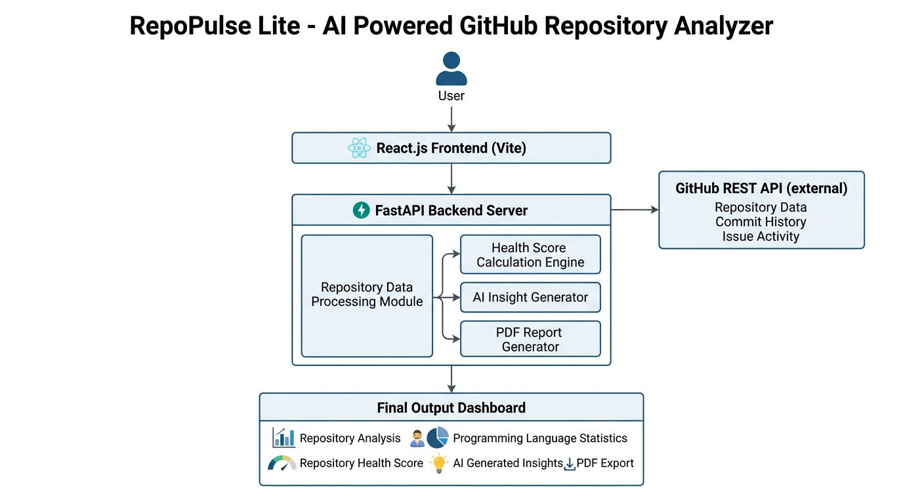
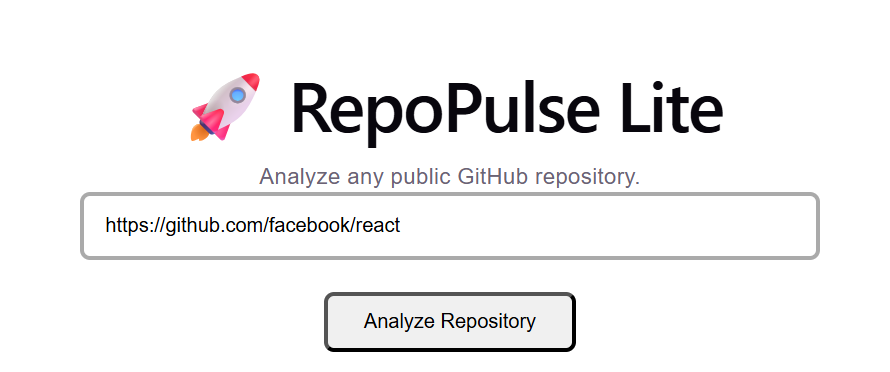
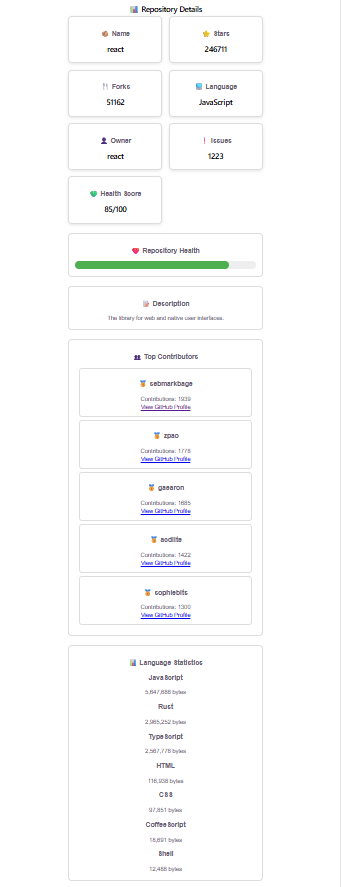
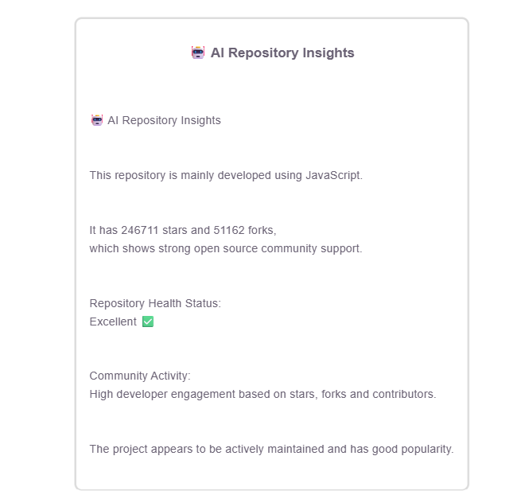
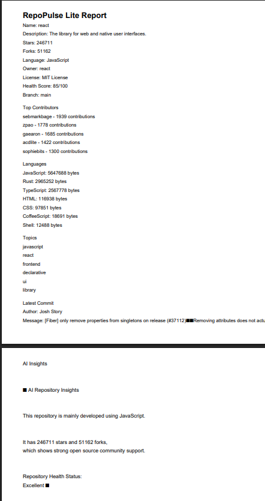

# RepoPulse Lite

AI-powered GitHub Repository Analyzer

## Project Overview

RepoPulse Lite is a web application that analyzes public GitHub repositories and provides detailed insights about repository performance, health status, contributors, programming languages, and overall community activity.

The application uses the GitHub REST API to collect repository information and generates AI-based insights along with downloadable PDF reports for better understanding of open-source projects.

## Features

- Analyze any public GitHub repository
- Fetch repository details using GitHub REST API
- Display repository statistics such as stars, forks, issues, and owner information
- Calculate repository health score based on repository activity
- Display top contributors and their contribution count
- Show programming language statistics
- Generate AI-powered repository insights
- Generate and download repository analysis reports in PDF format

## Technology Stack

### Frontend

- React.js
- Vite
- JavaScript
- CSS

### Backend

- Python
- FastAPI
- REST API

### APIs and Tools

- GitHub REST API
- ReportLab for PDF Generation

## System Architecture

### Home Page

### Repository Analysis

### AI Insights

### PDF Report

## 🌐 Live Demo

- **🚀 Frontend Application:**  
  https://repo-pulse-lite.vercel.app

- **⚙️ Backend API:**  
  https://repopulselite.onrender.com

- **📄 API Documentation (Swagger):**  
  https://repopulselite.onrender.com/docs

- **💻 GitHub Repository:**  
  https://github.com/Sprinkel23/RepoPulseLite

